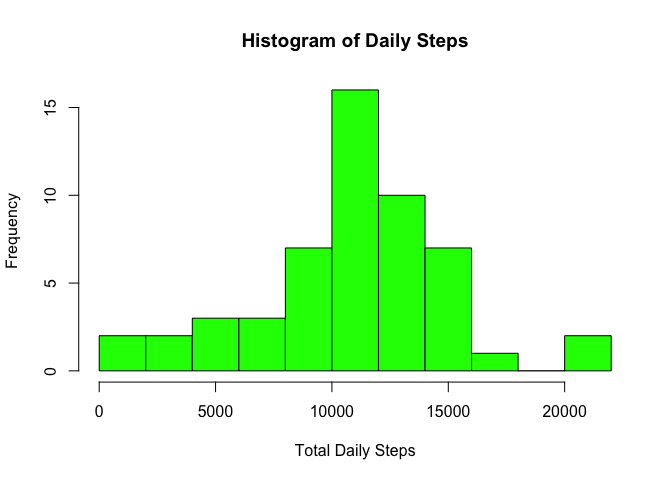
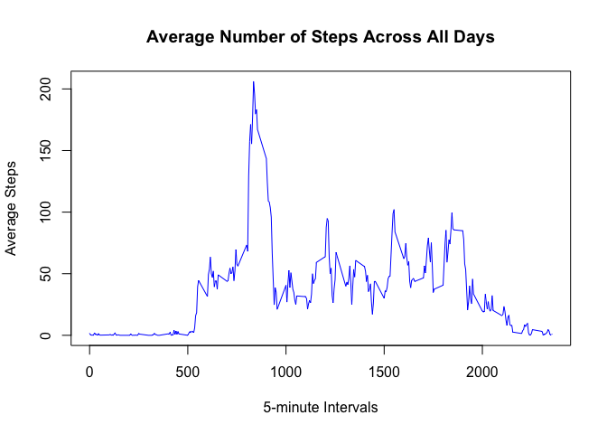
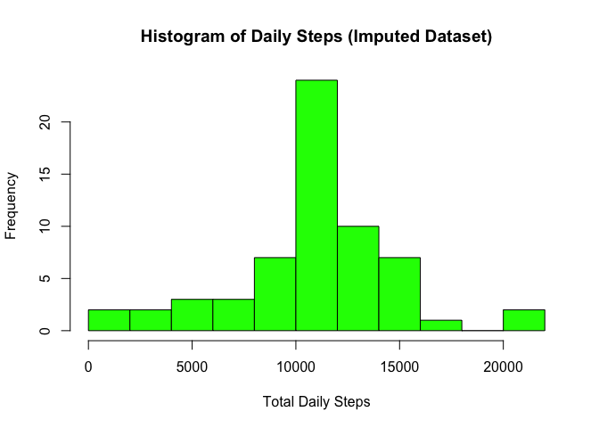
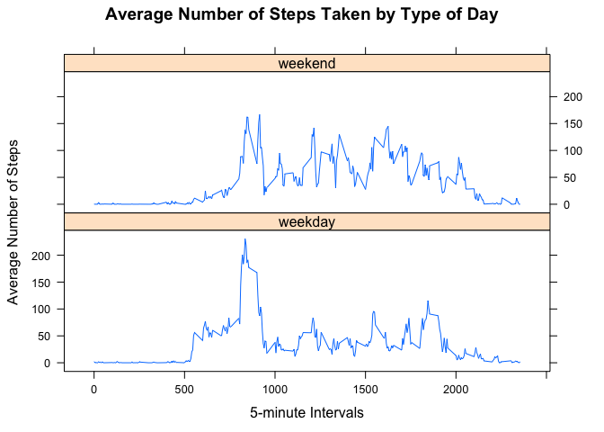

## Prelims
### Loading and preprocessing the data

Assume that the working directory is set to the appropriate location. Now load the data and examine its structure.


```r
data <- read.csv("activity.csv", header = T, stringsAsFactors = F)
str(data)
```

```
## 'data.frame':	17568 obs. of  3 variables:
##  $ steps   : int  NA NA NA NA NA NA NA NA NA NA ...
##  $ date    : chr  "2012-10-01" "2012-10-01" "2012-10-01" "2012-10-01" ...
##  $ interval: int  0 5 10 15 20 25 30 35 40 45 ...
```

Looking ahead to the next question, perhaps it is a good idea to determine how many days are in this data set (looks like just over 2 months).


```r
unique(data$date)
```

```
##  [1] "2012-10-01" "2012-10-02" "2012-10-03" "2012-10-04" "2012-10-05"
##  [6] "2012-10-06" "2012-10-07" "2012-10-08" "2012-10-09" "2012-10-10"
## [11] "2012-10-11" "2012-10-12" "2012-10-13" "2012-10-14" "2012-10-15"
## [16] "2012-10-16" "2012-10-17" "2012-10-18" "2012-10-19" "2012-10-20"
## [21] "2012-10-21" "2012-10-22" "2012-10-23" "2012-10-24" "2012-10-25"
## [26] "2012-10-26" "2012-10-27" "2012-10-28" "2012-10-29" "2012-10-30"
## [31] "2012-10-31" "2012-11-01" "2012-11-02" "2012-11-03" "2012-11-04"
## [36] "2012-11-05" "2012-11-06" "2012-11-07" "2012-11-08" "2012-11-09"
## [41] "2012-11-10" "2012-11-11" "2012-11-12" "2012-11-13" "2012-11-14"
## [46] "2012-11-15" "2012-11-16" "2012-11-17" "2012-11-18" "2012-11-19"
## [51] "2012-11-20" "2012-11-21" "2012-11-22" "2012-11-23" "2012-11-24"
## [56] "2012-11-25" "2012-11-26" "2012-11-27" "2012-11-28" "2012-11-29"
## [61] "2012-11-30"
```

## Question 1
### What is mean total number of steps taken per day?

1. We will start by calculating the total number of steps taken per day. The `dplyr` package is used for the appropriate aggregate functions, however, it will suppress the output after a certain number of days. Hence, we will make use of the `kable` function within `knitr` to produce a complete table of days and steps.


```r
library(dplyr)
library(knitr)
library(kableExtra)
byday <- data %>% group_by(date) %>% summarise(DailySteps = sum(steps))
knitr::kable(byday) %>%
     kable_styling(full_width = F, bootstrap_options = "striped")
```

<table class="table table-striped" style="width: auto !important; margin-left: auto; margin-right: auto;">
 <thead>
  <tr>
   <th style="text-align:left;"> date </th>
   <th style="text-align:right;"> DailySteps </th>
  </tr>
 </thead>
<tbody>
  <tr>
   <td style="text-align:left;"> 2012-10-01 </td>
   <td style="text-align:right;"> NA </td>
  </tr>
  <tr>
   <td style="text-align:left;"> 2012-10-02 </td>
   <td style="text-align:right;"> 126 </td>
  </tr>
  <tr>
   <td style="text-align:left;"> 2012-10-03 </td>
   <td style="text-align:right;"> 11352 </td>
  </tr>
  <tr>
   <td style="text-align:left;"> 2012-10-04 </td>
   <td style="text-align:right;"> 12116 </td>
  </tr>
  <tr>
   <td style="text-align:left;"> 2012-10-05 </td>
   <td style="text-align:right;"> 13294 </td>
  </tr>
  <tr>
   <td style="text-align:left;"> 2012-10-06 </td>
   <td style="text-align:right;"> 15420 </td>
  </tr>
  <tr>
   <td style="text-align:left;"> 2012-10-07 </td>
   <td style="text-align:right;"> 11015 </td>
  </tr>
  <tr>
   <td style="text-align:left;"> 2012-10-08 </td>
   <td style="text-align:right;"> NA </td>
  </tr>
  <tr>
   <td style="text-align:left;"> 2012-10-09 </td>
   <td style="text-align:right;"> 12811 </td>
  </tr>
  <tr>
   <td style="text-align:left;"> 2012-10-10 </td>
   <td style="text-align:right;"> 9900 </td>
  </tr>
  <tr>
   <td style="text-align:left;"> 2012-10-11 </td>
   <td style="text-align:right;"> 10304 </td>
  </tr>
  <tr>
   <td style="text-align:left;"> 2012-10-12 </td>
   <td style="text-align:right;"> 17382 </td>
  </tr>
  <tr>
   <td style="text-align:left;"> 2012-10-13 </td>
   <td style="text-align:right;"> 12426 </td>
  </tr>
  <tr>
   <td style="text-align:left;"> 2012-10-14 </td>
   <td style="text-align:right;"> 15098 </td>
  </tr>
  <tr>
   <td style="text-align:left;"> 2012-10-15 </td>
   <td style="text-align:right;"> 10139 </td>
  </tr>
  <tr>
   <td style="text-align:left;"> 2012-10-16 </td>
   <td style="text-align:right;"> 15084 </td>
  </tr>
  <tr>
   <td style="text-align:left;"> 2012-10-17 </td>
   <td style="text-align:right;"> 13452 </td>
  </tr>
  <tr>
   <td style="text-align:left;"> 2012-10-18 </td>
   <td style="text-align:right;"> 10056 </td>
  </tr>
  <tr>
   <td style="text-align:left;"> 2012-10-19 </td>
   <td style="text-align:right;"> 11829 </td>
  </tr>
  <tr>
   <td style="text-align:left;"> 2012-10-20 </td>
   <td style="text-align:right;"> 10395 </td>
  </tr>
  <tr>
   <td style="text-align:left;"> 2012-10-21 </td>
   <td style="text-align:right;"> 8821 </td>
  </tr>
  <tr>
   <td style="text-align:left;"> 2012-10-22 </td>
   <td style="text-align:right;"> 13460 </td>
  </tr>
  <tr>
   <td style="text-align:left;"> 2012-10-23 </td>
   <td style="text-align:right;"> 8918 </td>
  </tr>
  <tr>
   <td style="text-align:left;"> 2012-10-24 </td>
   <td style="text-align:right;"> 8355 </td>
  </tr>
  <tr>
   <td style="text-align:left;"> 2012-10-25 </td>
   <td style="text-align:right;"> 2492 </td>
  </tr>
  <tr>
   <td style="text-align:left;"> 2012-10-26 </td>
   <td style="text-align:right;"> 6778 </td>
  </tr>
  <tr>
   <td style="text-align:left;"> 2012-10-27 </td>
   <td style="text-align:right;"> 10119 </td>
  </tr>
  <tr>
   <td style="text-align:left;"> 2012-10-28 </td>
   <td style="text-align:right;"> 11458 </td>
  </tr>
  <tr>
   <td style="text-align:left;"> 2012-10-29 </td>
   <td style="text-align:right;"> 5018 </td>
  </tr>
  <tr>
   <td style="text-align:left;"> 2012-10-30 </td>
   <td style="text-align:right;"> 9819 </td>
  </tr>
  <tr>
   <td style="text-align:left;"> 2012-10-31 </td>
   <td style="text-align:right;"> 15414 </td>
  </tr>
  <tr>
   <td style="text-align:left;"> 2012-11-01 </td>
   <td style="text-align:right;"> NA </td>
  </tr>
  <tr>
   <td style="text-align:left;"> 2012-11-02 </td>
   <td style="text-align:right;"> 10600 </td>
  </tr>
  <tr>
   <td style="text-align:left;"> 2012-11-03 </td>
   <td style="text-align:right;"> 10571 </td>
  </tr>
  <tr>
   <td style="text-align:left;"> 2012-11-04 </td>
   <td style="text-align:right;"> NA </td>
  </tr>
  <tr>
   <td style="text-align:left;"> 2012-11-05 </td>
   <td style="text-align:right;"> 10439 </td>
  </tr>
  <tr>
   <td style="text-align:left;"> 2012-11-06 </td>
   <td style="text-align:right;"> 8334 </td>
  </tr>
  <tr>
   <td style="text-align:left;"> 2012-11-07 </td>
   <td style="text-align:right;"> 12883 </td>
  </tr>
  <tr>
   <td style="text-align:left;"> 2012-11-08 </td>
   <td style="text-align:right;"> 3219 </td>
  </tr>
  <tr>
   <td style="text-align:left;"> 2012-11-09 </td>
   <td style="text-align:right;"> NA </td>
  </tr>
  <tr>
   <td style="text-align:left;"> 2012-11-10 </td>
   <td style="text-align:right;"> NA </td>
  </tr>
  <tr>
   <td style="text-align:left;"> 2012-11-11 </td>
   <td style="text-align:right;"> 12608 </td>
  </tr>
  <tr>
   <td style="text-align:left;"> 2012-11-12 </td>
   <td style="text-align:right;"> 10765 </td>
  </tr>
  <tr>
   <td style="text-align:left;"> 2012-11-13 </td>
   <td style="text-align:right;"> 7336 </td>
  </tr>
  <tr>
   <td style="text-align:left;"> 2012-11-14 </td>
   <td style="text-align:right;"> NA </td>
  </tr>
  <tr>
   <td style="text-align:left;"> 2012-11-15 </td>
   <td style="text-align:right;"> 41 </td>
  </tr>
  <tr>
   <td style="text-align:left;"> 2012-11-16 </td>
   <td style="text-align:right;"> 5441 </td>
  </tr>
  <tr>
   <td style="text-align:left;"> 2012-11-17 </td>
   <td style="text-align:right;"> 14339 </td>
  </tr>
  <tr>
   <td style="text-align:left;"> 2012-11-18 </td>
   <td style="text-align:right;"> 15110 </td>
  </tr>
  <tr>
   <td style="text-align:left;"> 2012-11-19 </td>
   <td style="text-align:right;"> 8841 </td>
  </tr>
  <tr>
   <td style="text-align:left;"> 2012-11-20 </td>
   <td style="text-align:right;"> 4472 </td>
  </tr>
  <tr>
   <td style="text-align:left;"> 2012-11-21 </td>
   <td style="text-align:right;"> 12787 </td>
  </tr>
  <tr>
   <td style="text-align:left;"> 2012-11-22 </td>
   <td style="text-align:right;"> 20427 </td>
  </tr>
  <tr>
   <td style="text-align:left;"> 2012-11-23 </td>
   <td style="text-align:right;"> 21194 </td>
  </tr>
  <tr>
   <td style="text-align:left;"> 2012-11-24 </td>
   <td style="text-align:right;"> 14478 </td>
  </tr>
  <tr>
   <td style="text-align:left;"> 2012-11-25 </td>
   <td style="text-align:right;"> 11834 </td>
  </tr>
  <tr>
   <td style="text-align:left;"> 2012-11-26 </td>
   <td style="text-align:right;"> 11162 </td>
  </tr>
  <tr>
   <td style="text-align:left;"> 2012-11-27 </td>
   <td style="text-align:right;"> 13646 </td>
  </tr>
  <tr>
   <td style="text-align:left;"> 2012-11-28 </td>
   <td style="text-align:right;"> 10183 </td>
  </tr>
  <tr>
   <td style="text-align:left;"> 2012-11-29 </td>
   <td style="text-align:right;"> 7047 </td>
  </tr>
  <tr>
   <td style="text-align:left;"> 2012-11-30 </td>
   <td style="text-align:right;"> NA </td>
  </tr>
</tbody>
</table>

2. Now we will make a histogram of the total number of steps taken each day.


```r
steps <- byday$DailySteps
hist(steps, main = "Histogram of Daily Steps", xlab = "Total Daily Steps", breaks = 10, col = 'green')
```

<!-- -->

3. Now we report the mean and median number of steps taken each day. From the histogram, it appears that the distribution of steps is somewhat normal. Hence, these two measures of center should be slightly greater than 10,000.


```r
summary(byday$DailySteps)
```

```
##    Min. 1st Qu.  Median    Mean 3rd Qu.    Max.    NA's 
##      41    8841   10765   10766   13294   21194       8
```
**And yes, the median number of steps is 10,765; the mean is 10,766.**

## Question 2
### What is the average daily activity pattern?

1. Our first task is to create a time-series plot of the average number of steps across all days versus the 5-minute interval. There are various ways to go about this, but we will use the aggregate functions in `dpylr` once again to get the data ready for plotting.


```r
timeseriesdata <- data %>% group_by(interval) %>% summarise(meanstep = mean(steps, na.rm = T))
plot(timeseriesdata$interval, timeseriesdata$meanstep, type = 'l', main = 'Average Number of Steps Across All Days', xlab = '5-minute Intervals', ylab = 'Average Steps', col = 'blue')
```

<!-- -->

2. Now we wish to find the maximum number of average steps taken across the intervals, along with the corresponding interval. Again, there are numerous ways to do this--`grepl` and `which.max` come to mind. But we'll choose a simple subsetting operation. The highest average number of steps is **206.2** and it occurs in interval **835** (this is also visually confirmed with the time-series plot).


```r
# find max number of average steps
library(xtable)
ymax <- max(timeseriesdata$meanstep)

# now subset data frame according to previous result
xmax <- timeseriesdata[timeseriesdata$meanstep == ymax,]

xmax %>% kable() %>% kable_styling(full_width = F)
```

<table class="table" style="width: auto !important; margin-left: auto; margin-right: auto;">
 <thead>
  <tr>
   <th style="text-align:right;"> interval </th>
   <th style="text-align:right;"> meanstep </th>
  </tr>
 </thead>
<tbody>
  <tr>
   <td style="text-align:right;"> 835 </td>
   <td style="text-align:right;"> 206.1698 </td>
  </tr>
</tbody>
</table>

## Question 3
### Imputing missing values

1. The first task is count the number of NAs, or missing values in the dataset. This equates to counting the number of rows with NAs.


```r
sum(is.na(data))
```

```
## [1] 2304
```

2. Next, we want to create a new dataset that does not contain any NA values. There are two parts to this story: 1) decide on an imputation method; and 2) replace the NAs with values. Thankfully, the NA values are only in the `steps` column of the original file so we need only worry about replacing blanks in one column. Let's choose the mean number of steps for that particular interval since we've already calculated that previously.  

This might involve some careful coding, so let's test this out first with one row. We see that the very first row corresponding to 2012-10-01 has NA in its `steps` column. We've also computed previously that the mean number of steps for interval 0 is 1.7169811. We would like to replace NA with 1.7169811 in this first row, first column.


```r
#make a copy of original data
data_updated <- data

#set NA value to max steps for 0 time interval
data_updated[1,1] = 1.7169811

#did it work?
head(data_updated)
```

```
##      steps       date interval
## 1 1.716981 2012-10-01        0
## 2       NA 2012-10-01        5
## 3       NA 2012-10-01       10
## 4       NA 2012-10-01       15
## 5       NA 2012-10-01       20
## 6       NA 2012-10-01       25
```

Ok, it worked. Problem is, we do not know where all of the NA values are in the `steps` column, so we cannot continue to replace these with row and column positions (unless free time is not something you enjoy). We will need to write some code that:  
* finds the NA value in the `steps` column  
* examines the corresponding `interval` in the same row  
* retrieves the mean number of steps for that interval  
* replaces the NA with the mean number of steps  


```r
data_updated <- data
for(i in 1:nrow(data_updated)) {
     if(is.na(data_updated$steps[i])){
        na_interval <- data_updated$interval[i]
        place <- timeseriesdata[timeseriesdata$interval == na_interval,]
        data_updated$steps[i] <- place$meanstep
     }
}
head(data_updated)
```

```
##       steps       date interval
## 1 1.7169811 2012-10-01        0
## 2 0.3396226 2012-10-01        5
## 3 0.1320755 2012-10-01       10
## 4 0.1509434 2012-10-01       15
## 5 0.0754717 2012-10-01       20
## 6 2.0943396 2012-10-01       25
```

And just to compare this imputation with the time series data from before, let's compare the first few rows.


```r
cbind(head(data_updated), head(timeseriesdata))
```

```
##       steps       date interval interval  meanstep
## 1 1.7169811 2012-10-01        0        0 1.7169811
## 2 0.3396226 2012-10-01        5        5 0.3396226
## 3 0.1320755 2012-10-01       10       10 0.1320755
## 4 0.1509434 2012-10-01       15       15 0.1509434
## 5 0.0754717 2012-10-01       20       20 0.0754717
## 6 2.0943396 2012-10-01       25       25 2.0943396
```

3. We will finish the question with computing the same tasks as before--histogram of the total number of steps taken each day, along with the median and mean total number of daily steps.


```r
byday_updated <- data_updated %>% group_by(date) %>% summarise(DailyStepsUpdate = sum(steps))
steps_updated <- byday_updated$DailyStepsUpdate
hist(steps_updated, main = "Histogram of Daily Steps (Imputed Dataset)", xlab = "Total Daily Steps", breaks = 10, col = 'green')
```

<!-- -->


```r
summary(steps_updated)
```

```
##    Min. 1st Qu.  Median    Mean 3rd Qu.    Max. 
##      41    9819   10766   10766   12811   21194
```

```r
fivenum(steps_updated)
```

```
## [1]    41.00  9819.00 10766.19 12811.00 21194.00
```

Thus, imputing the missing values with the mean steps taken for that interval did not have that much effect on the median and mean number of steps. There is a slight difference in the shape of the distribution--the tails are flatter in the imputed dataset, making it look slightly less *normal* than the original. Hence, we see differences in the 1st and 3rd quartiles between the two histograms.

## Question 4
### Are there differences in activity patterns between weekdays and weekends?
--*For this part the `weekdays()` function may be of some help here. Use the dataset with the filled-in missing values for this part.*

1. For the first part of this question, we will add a column (variable) to the imputed data set that indicates whether the date is a weekday or weekend. But to do this, we'll first add a 'dummy' column.


```r
#here we add a column to get the day of the week assigned to the date
data_updated$day <- weekdays(as.Date(data_updated$date))

#now we setup a blank column that will indicate the type of day it is
data_updated$type_of_day <- ""

#now implement the logic that will fill the blank column
data_updated[data_updated$day == "Saturday" | data_updated$day == "Sunday",]$type_of_day <- "weekend"
data_updated[!(data_updated$day == "Saturday" | data_updated$day == "Sunday"),]$type_of_day <- "weekday"

#now convert the type of day column to a factor
data_updated$type_of_day <- factor(data_updated$type_of_day)

#preview the changes; note the 'day' column which we will not use for plotting next
str(data_updated)
```

```
## 'data.frame':	17568 obs. of  5 variables:
##  $ steps      : num  1.717 0.3396 0.1321 0.1509 0.0755 ...
##  $ date       : chr  "2012-10-01" "2012-10-01" "2012-10-01" "2012-10-01" ...
##  $ interval   : int  0 5 10 15 20 25 30 35 40 45 ...
##  $ day        : chr  "Monday" "Monday" "Monday" "Monday" ...
##  $ type_of_day: Factor w/ 2 levels "weekday","weekend": 1 1 1 1 1 1 1 1 1 1 ...
```

```r
#choose a random sample of rows to test the factor application
set.seed(123)
data_updated %>% sample_n(.,10)
```

```
##       steps       date interval       day type_of_day
## 5053      0 2012-10-18     1300  Thursday     weekday
## 13849     0 2012-11-18      200    Sunday     weekend
## 7185      0 2012-10-25     2240  Thursday     weekday
## 15511     0 2012-11-23     2030    Friday     weekday
## 16519     0 2012-11-27      830   Tuesday     weekday
## 801      22 2012-10-03     1840 Wednesday     weekday
## 9275      0 2012-11-02      450    Friday     weekday
## 15672     0 2012-11-24      955  Saturday     weekend
## 9684     21 2012-11-03     1455  Saturday     weekend
## 8018     38 2012-10-28     2005    Sunday     weekend
```

2. For the final part of this question, we will produce a time-series plot of average steps taken across the time intervals. While this is similar to the result in Question 2, this one will be a panel plot that accounts for weekday vs. weekend. This time, it will be easier to use the `aggregate` function rather than those functions within the `dplyr` package because of the conditioning aspect.


```r
library(lattice)
timeseriesdata_updated <- aggregate(steps ~ interval + type_of_day, data = data_updated, mean)
xyplot(steps ~ interval | type_of_day, data = timeseriesdata_updated, layout = c(1,2), type = 'l', xlab = "5-minute Intervals", ylab = "Average Number of Steps", main = "Average Number of Steps Taken by Type of Day")
```

<!-- -->
